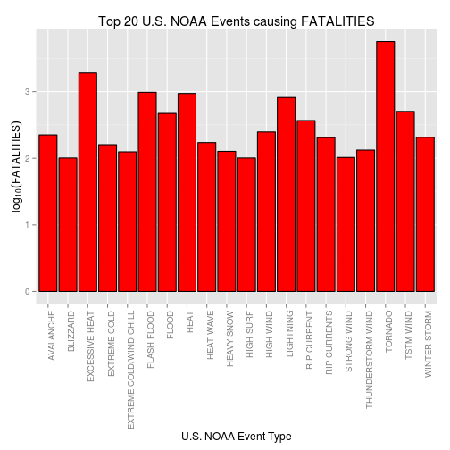
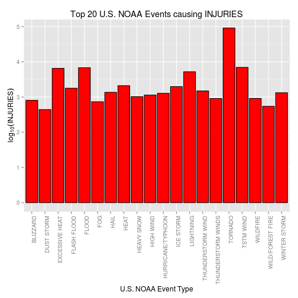
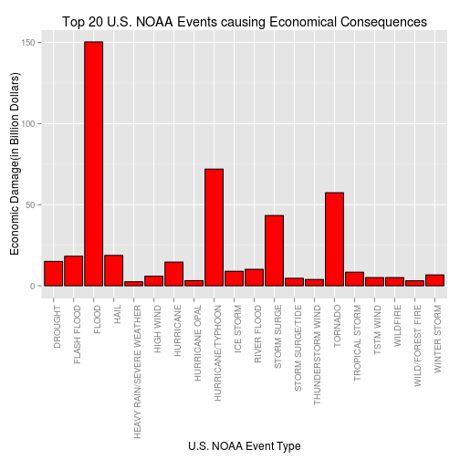

PA2 - U.S. NOAA Storm Events Impact Analysis (1950 - 2011)
========================================================

## Synopsis
This report explores U.S. National Oceanic and Atmospheric Administration's (NOAA) storm database (1950-2011). We identify events(top 20) which had the most harmful effects on human population and also pin point events(top 20) leading to greatest economic consequences.
Reference data is [storm data](https://d396qusza40orc.cloudfront.net/repdata%2Fdata%2FStormData.csv.bz2) and we make use of 7 events("EVTYPE", "FATALITIES","INJURIES","PROPDMG","PROPDMGEXP","CROPDMG","CROPDMGEXP") to analyze, conclude and present our investigation.
Our final conclusion is "TORNADO" & "EXCESSIVE HEAT" are having the worst impact on human population and "FLOOD", "HURRICANE/TYPHOON" & "TORNADO" are the top events for economical damages(in hundreds of Billion Dollars).


## Data Processing

Setting the echo for code chunks as TRUE globally.

```r
library(knitr)
opts_chunk$set(echo=TRUE)
```

### 1. Across the United States, which types of events (as indicated in the EVTYPE variable) are most harmful with respect to population health?

Reading the storm data file and storing it in data frame format for futher analysis.

```r
dat <- bzfile("repdata-data-StormData.csv.bz2")
sd <- read.csv(dat)
dim(sd)
```

```
## [1] 902297     37
```

Checking out the labels in data

```r
names(sd)
```

```
##  [1] "STATE__"    "BGN_DATE"   "BGN_TIME"   "TIME_ZONE"  "COUNTY"    
##  [6] "COUNTYNAME" "STATE"      "EVTYPE"     "BGN_RANGE"  "BGN_AZI"   
## [11] "BGN_LOCATI" "END_DATE"   "END_TIME"   "COUNTY_END" "COUNTYENDN"
## [16] "END_RANGE"  "END_AZI"    "END_LOCATI" "LENGTH"     "WIDTH"     
## [21] "F"          "MAG"        "FATALITIES" "INJURIES"   "PROPDMG"   
## [26] "PROPDMGEXP" "CROPDMG"    "CROPDMGEXP" "WFO"        "STATEOFFIC"
## [31] "ZONENAMES"  "LATITUDE"   "LONGITUDE"  "LATITUDE_E" "LONGITUDE_"
## [36] "REMARKS"    "REFNUM"
```

Subsetting data columns for human population impact analysis.

```r
nsd <- sd[,c(8, 23, 24)]
nsd[,1] <- as.character(nsd[,1])
aggdata <- aggregate(nsd[,2:3], by=list(nsd$EVTYPE), FUN=sum, na.rm=T)
names(aggdata)[1] <- "EVTYPE"

od <- aggdata[order(-aggdata[,2], -aggdata[,3]), ]
head(od, n=10)
```

```
##             EVTYPE FATALITIES INJURIES
## 830        TORNADO       5633    91346
## 123 EXCESSIVE HEAT       1903     6525
## 147    FLASH FLOOD        978     1777
## 269           HEAT        937     2100
## 452      LIGHTNING        816     5230
## 854      TSTM WIND        504     6957
## 164          FLOOD        470     6789
## 581    RIP CURRENT        368      232
## 354      HIGH WIND        248     1137
## 11       AVALANCHE        224      170
```

#### Plot showing the top 20 events responsible for human fatalities 

```r
library(ggplot2)
library(scales)

od <- aggdata[order(-aggdata[,2]), ]
names(od)[1] <- "EVTYPE"
topf <- head(od, n=20)
ggplot(data=topf, aes(x=EVTYPE, y=log10(FATALITIES))) + geom_bar(stat = "identity", fill="#FF0000", colour="black") + theme(axis.text.x = element_text(angle = 90, hjust = 1)) + ggtitle("Top 20 U.S. NOAA Events causing FATALITIES") + labs(y=expression(log[10](FATALITIES)), x="U.S. NOAA Event Type") 
```

 

#### Plot showing the top 20 events responsible for human injuries 

```r
od <- aggdata[order(-aggdata[,3]), ]
names(od)[1] <- "EVTYPE"
topi <- head(od, n=20)
ggplot(data=topi, aes(x=EVTYPE, y=log10(INJURIES))) + geom_bar(stat = "identity", fill="#FF0000", colour="black") + theme(axis.text.x = element_text(angle = 90, hjust = 1)) + ggtitle("Top 20 U.S. NOAA Events causing INJURIES") + labs(y=expression(log[10](INJURIES)), x="U.S. NOAA Event Type") 
```

 

#### Top Events causing maximum harm with respect to human population health are:

```r
intersect(topf[,1], topi[,1])
```

```
##  [1] "TORNADO"           "EXCESSIVE HEAT"    "FLASH FLOOD"      
##  [4] "HEAT"              "LIGHTNING"         "TSTM WIND"        
##  [7] "FLOOD"             "HIGH WIND"         "WINTER STORM"     
## [10] "THUNDERSTORM WIND" "HEAVY SNOW"        "BLIZZARD"
```

### 2. Across the United States, which types of events have the greatest economic consequences?


```r
##1. subsetting relevant columns for economic impact analysis.
pd <- sd[,c(8,25,26,27,28)]

##2. unique exponents in property damage and crop damage 
unique((pd[,3]))
```

```
##  [1] K M   B m + 0 5 6 ? 4 2 3 h 7 H - 1 8
## Levels:  - ? + 0 1 2 3 4 5 6 7 8 B h H K m M
```

```r
unique((pd[,5]))
```

```
## [1]   M K m B ? 0 k 2
## Levels:  ? 0 2 B k K m M
```


```r
##3. converting exponents to uppercase for consistency.
pd[,3] <- toupper(pd[,3])
pd[,5] <- toupper(pd[,5])

##4. given a value and exponent - lets calculate the actual value and return
expval <- function(x, exp = "") {
    switch(exp, `-` = x * -1, `?` = x, `+` = x, `1` = x, `2` = x * (10^2), `3` = x * 
        (10^3), `4` = x * (10^4), `5` = x * (10^5), `6` = x * (10^6), `7` = x * 
        (10^7), `8` = x * (10^8), H = x * 100, K = x * 1000, M = x * 1e+06, 
        B = x * 1e+09, x)
}

##5. Aggregating based on event type and exponents.
pad <- aggregate(pd[,c(2,4)], by=list(pd$EVTYPE, pd$PROPDMGEXP, pd$CROPDMGEXP), FUN=sum, na.rm=T)

##6. Remove rows with vaues 0 - they wont be relevant for analysis.
pf = pad[apply(pad[c(4,5)], 1, function(row) any(row != 0 )), ]

##7. Given an event lets calculate the total dollar impact combining property and crop damage.
nr <- nrow(pf)
total <- numeric()
for (i in 1:nr) {
  val <- expval(pf[i,4], pf[i,2])
  val <- val + expval(pf[i,5], pf[i,3])
  total <- append(total, val)
}

length(total)
```

```
## [1] 874
```

```r
head(total)
```

```
## [1] 132   4   7  54  10   3
```

Lets check out the interim data frame.

```r
pf$TOTALDMG <- total
names(pf)[1] <- "EVTYPE"
head(pf)
```

```
##                 EVTYPE Group.2 Group.3 PROPDMG CROPDMG TOTALDMG
## 127        FLASH FLOOD                     132       0      132
## 131     FLASH FLOODING                       4       0        4
## 135              FLOOD                       7       0        7
## 191               HAIL                      54       0       54
## 259 HEAVY SNOW SQUALLS                      10       0       10
## 289         HIGH WINDS                       3       0        3
```

Aggregating Total Damage based on unique event types.

```r
dmg <- aggregate(pf$TOTALDMG, by=list(pf$EVTYPE), FUN=sum, na.rm=T)
names(dmg) <- c("EVTYPE", "TOTALDMG")
head(dmg)
```

```
##                   EVTYPE TOTALDMG
## 1                      ?     5000
## 2    AGRICULTURAL FREEZE 28820000
## 3          APACHE COUNTY     5000
## 4 ASTRONOMICAL HIGH TIDE  9425000
## 5  ASTRONOMICAL LOW TIDE   320000
## 6              AVALANCHE  3721800
```

```r
fdmg <- dmg[order(-dmg[,2]), ]
head(fdmg)
```

```
##                EVTYPE  TOTALDMG
## 69              FLOOD 1.503e+11
## 195 HURRICANE/TYPHOON 7.191e+10
## 352           TORNADO 5.736e+10
## 297       STORM SURGE 4.332e+10
## 113              HAIL 1.876e+10
## 56        FLASH FLOOD 1.824e+10
```

#### Plot depicting the top 20 events causing the maximum economic damage(in Billion Dollars).

```r
tope <- head(fdmg, n=20)
ggplot(data=tope, aes(x=EVTYPE, y=TOTALDMG/1e+9)) + geom_bar(stat = "identity", fill="#FF0000", colour="black") + theme(axis.text.x = element_text(angle = 90, hjust = 1)) + ggtitle("Top 20 U.S. NOAA Events causing Economical Consequences") + labs(y="Economic Damage(in Billion Dollars)", x="U.S. NOAA Event Type")
```

 

## RESULTS
Below we are presenting the final conclusion (events) again from the previous steps of data processing and analysis.
#### Top Events causing maximum harm with respect to human population health(fatalities & injuries combined) are:

```r
intersect(topf[,1], topi[,1])
```

```
##  [1] "TORNADO"           "EXCESSIVE HEAT"    "FLASH FLOOD"      
##  [4] "HEAT"              "LIGHTNING"         "TSTM WIND"        
##  [7] "FLOOD"             "HIGH WIND"         "WINTER STORM"     
## [10] "THUNDERSTORM WIND" "HEAVY SNOW"        "BLIZZARD"
```

#### Top Events causing maximum economic damage (100's of Billion Dollars):

```r
head(fdmg, n=10L)
```

```
##                EVTYPE  TOTALDMG
## 69              FLOOD 1.503e+11
## 195 HURRICANE/TYPHOON 7.191e+10
## 352           TORNADO 5.736e+10
## 297       STORM SURGE 4.332e+10
## 113              HAIL 1.876e+10
## 56        FLASH FLOOD 1.824e+10
## 35            DROUGHT 1.502e+10
## 187         HURRICANE 1.461e+10
## 260       RIVER FLOOD 1.015e+10
## 204         ICE STORM 8.967e+09
```

Thanks for reading the report - Have a good day ahead!! :)
