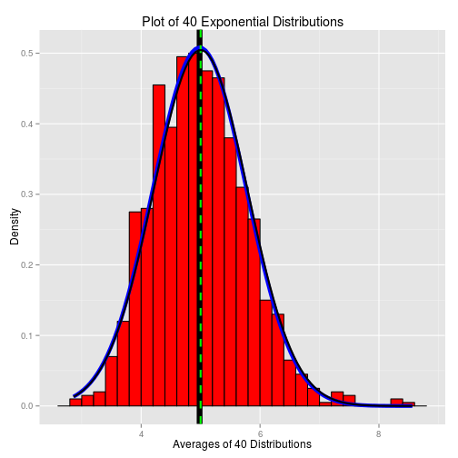

Statistical Inference - Assignment 1
================================================

This report investigates the distribution of averages of 40 exponential(0.2)s. we are going to do a thousand or so simulated averages of 40 exponentials.

#### Given data for the problem:
The exponential distribution will be simulated in R with rexp(n, lambda) where lambda is the rate parameter. The mean of exponential distribution is 1/lambda and the standard deviation is also 1/lambda. We are going to set lambda = 0.2 for all of the simulations.

Setting the echo for code chunks as TRUE globally and including required packages.

```r
library(knitr)
library(ggplot2)
opts_chunk$set(echo=TRUE)
set.seed(42)
```


```r
n <- 40
lambda <- 0.2
sim <- 1000
```

#### Given Theortical Values - Calculation

```r
TMean = 1/lambda
TStdDev = ((1/lambda) * (1/sqrt(n)))
TVar = TStdDev^2
```

#### Calculating the empirical Values:

```r
data <- matrix(rexp(n*sim, lambda), sim)
row_means <- apply(data,1,mean)
emp_mean <- mean(row_means)
emp_sd <- sd(row_means)
emp_var <- var(row_means)
```

### 1. Show where the distribution is centered at and compare it to the theoretical center of the distribution.
The actual(empirical) distribution is centered at **4.9831** compared to the theoretical center ie. **5**

### 2. Show how variable it is and compare it to the theoretical variance of the distribution.
The actual(empirical) variance is **0.6165** compared to the theoretical variance ie. **0.625**

Actual(empirical) standard deviation is **0.7852** compared to the theoretical std deviation ie. **0.7906**

Please refer below table for the consolidated comparisons between the Theoretical Values and the Actual Emprical Values

|<span style="color:green">Statistical_Variable</span> | <span style="color:green">Theoretical_Value</span> | <span style="color:green">Empirical_Value</span> |
|:-------------------:|:-----------------:|:---------------:|
|**Mean**                 |**5**          |**4.9831**     |
|**Standard Deviation**   |**0.7906**        |**0.7852**       |
|**Variance**             |**0.625**           |**0.6165**      |


### 3. Show that the distribution is approximately normal.
Graphical representation below shows the comparison between the theoretical values and empirical values for the exponential distribution.
The plot clearly shows that we get a normal distribution (curve is shown in black (theoretical) and blue(empirical)) due to Central Limit Theorem kicking in. 
* Theoretical Mean is show in dashed Green line.
* Empirical (Actual) Mean is show in thick black line.
* Emirical normal curve line(BLUE) from Empirical Mean and Std Deviation.
* Theoretical normal curve line(BLACK) from Theoretical Mean and Std Deviation.

```r
dfrm <- data.frame(row_means)
ggplot(dfrm,aes(x=row_means)) +  geom_histogram(binwidth = lambda,fill="red",color="black",aes(y = ..density..)) +  labs(title="Plot of 40 Exponential Distributions", x="Averages of 40 Distributions", y="Density") + geom_vline(xintercept=emp_mean,size=3.0, color="black") +  stat_function(fun=dnorm,args=list(mean=emp_mean, sd=emp_sd),color = "blue", size = 2.0) +  geom_vline(xintercept=TMean,size=1.0,color="green",linetype = "dashed", size=3.0) +  stat_function(fun=dnorm,args=list(mean=TMean, sd=TStdDev),color = "black", size = 1.0)
```

 

-- Thanks for reading the report :)
