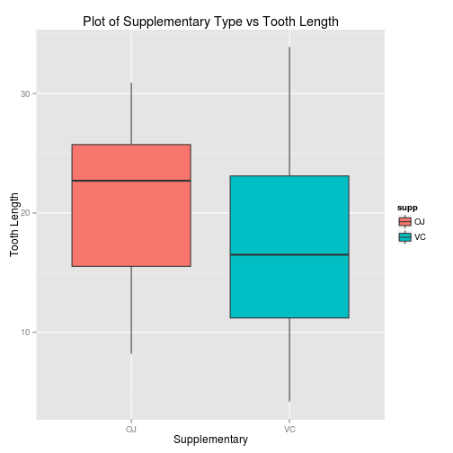
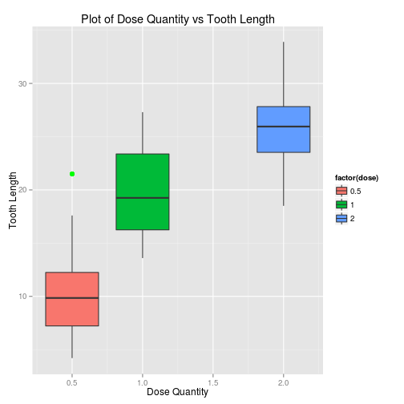

Statistical Inference - Assignment-2
=======================================
As part of the second assignment in statistical inference course, we need to analyze the ToothGrowth data in the R datasets package.

Setting the echo for code chunks as TRUE globally and including required packages.

```r
library(ggplot2)
opts_chunk$set(echo=TRUE)
```

## Exploratory Data Analysis

```r
data(ToothGrowth)
df <- data.frame(ToothGrowth)
dim(df)
```

```
## [1] 60  3
```

* Total Observations are 60 with 3 columns - len, supp, dose
* Tooth Length (len) is of type numeric values.
* Supplementary (supp) is of type OJ(orange juice) and VC(vitamin C)
* Dosage (dose) is of 3 Types - 0.5, 1 and 2


```r
summary(df)
```

```
##       len       supp         dose     
##  Min.   : 4.2   OJ:30   Min.   :0.50  
##  1st Qu.:13.1   VC:30   1st Qu.:0.50  
##  Median :19.2           Median :1.00  
##  Mean   :18.8           Mean   :1.17  
##  3rd Qu.:25.3           3rd Qu.:2.00  
##  Max.   :33.9           Max.   :2.00
```


```r
mean_supp = split(df$len, df$supp)
sapply(mean_supp, mean)
```

```
##    OJ    VC 
## 20.66 16.96
```


```r
mean_dose = split(df$len, df$dose)
sapply(mean_dose, mean)
```

```
##   0.5     1     2 
## 10.61 19.73 26.10
```

Plot of Supplementary Type vs Tooth Length

```r
ggplot(data=df, aes(x=supp, y=len)) + geom_boxplot(aes(fill=supp), outlier.colour = "green", outlier.size = 3) + labs(title="Plot of Supplementary Type vs Tooth Length", x="Supplementary", y="Tooth Length")
```

 


Plot of Dose Quantity vs Tooth Length

```r
ggplot(data=df, aes(x=dose, y=len)) + geom_boxplot(aes(fill=factor(dose)), outlier.colour = "green", outlier.size = 3) + labs(title="Plot of Dose Quantity vs Tooth Length", x="Dose Quantity", y="Tooth Length")
```

 

#### Conclusion:
* Among Supplement types "OJ" has higher mean affect on tooth growth of guinea pigs than "VC"
* Among different dose amounts higher dose seems to have significant affect on tooth length of guinea pigs.

## Statistical Inference On Tooth Data

Hypothesis (H0): Supplements of Orange Juice and Vitamin C have differential affects on the tooth length of guinea pigs. To validate this hypothesis we will perform a statistical t test on the supplement groups for differentiation.


```r
sapply(mean_supp, var)
```

```
##    OJ    VC 
## 43.63 68.33
```
Variance of the 2 sets of supplements looks pretty far apart.
Because of the above observation we would not assume equality of variances in the following t-test

```r
t.test(df$len[df$supp == "VC"], df$len[df$supp == "OJ"], paired=FALSE, var.equal=FALSE)
```

```
## 
## 	Welch Two Sample t-test
## 
## data:  df$len[df$supp == "VC"] and df$len[df$supp == "OJ"]
## t = -1.915, df = 55.31, p-value = 0.06063
## alternative hypothesis: true difference in means is not equal to 0
## 95 percent confidence interval:
##  -7.571  0.171
## sample estimates:
## mean of x mean of y 
##     16.96     20.66
```

The P-Value for this test is **0.06** And 95 percent confidence interval is **(-7.5710156,  0.1710156)** which contains **ZERO (0)** - that means we can not say conclusively that the supplements of "OJ" & "VC" have any differential impact on the Tooth Length of guinea pigs.

Lets now see the impact of dosage amount(0.5, 1, 2) in milli-grams have an affect on tooth length of guinea pigs or not.


```r
t.test(df$len[df$dose==1], df$len[df$dose==0.5], paired = FALSE, var.equal = TRUE)
```

```
## 
## 	Two Sample t-test
## 
## data:  df$len[df$dose == 1] and df$len[df$dose == 0.5]
## t = 6.477, df = 38, p-value = 1.266e-07
## alternative hypothesis: true difference in means is not equal to 0
## 95 percent confidence interval:
##   6.276 11.984
## sample estimates:
## mean of x mean of y 
##     19.73     10.61
```
As we can see P value is **+ve** and 95 percent confidence interval is **(6.276252, 11.983748)** which is greater than **ZERO(0)** - this translates into dose of **1 mg** of supplements have greater impact on tooth length than **0.5 mg** of supplements.

Now lets see if the above results holds for comparison between **2 mg** and **1 mg** of supplements.

```r
t.test(df$len[df$dose==2], df$len[df$dose==1], paired = FALSE, var.equal = TRUE)
```

```
## 
## 	Two Sample t-test
## 
## data:  df$len[df$dose == 2] and df$len[df$dose == 1]
## t = 4.901, df = 38, p-value = 1.811e-05
## alternative hypothesis: true difference in means is not equal to 0
## 95 percent confidence interval:
##  3.736 8.994
## sample estimates:
## mean of x mean of y 
##     26.10     19.73
```
Our results hold for comparison between **2 mg** and **1 mg** of supplements. P value is **+ve ie greater than ZERO(0)** and 95 percent confidence interval is **(3.735613, 8.994387)** which is greater than **ZERO(0)** - this translates into dose of **2 mg** of supplements have greater impact on tooth length than **1 mg** of supplements.

### Summary
* Supplements of "OJ" and "VC" do not have any affect on the tooth length of guinea pigs.
* Dosage amounts (0.5, 1, 2 mg) have increasing affect on the tooth length of guinea pigs - so if we increase the dose of supplements from 0.5mg -> 1.0mg -> 2.0mg - we are seeing increase in tooth length of guinea pigs.

-- Thanks for reading the report :)
